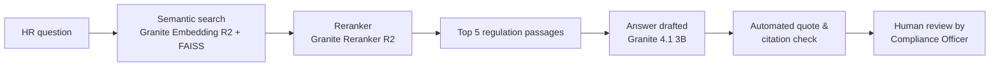

# HIPAA Compliance Knowledge Assistant for HR

**An AI assistant that answers HR's HIPAA questions from federal regulations, then checks its own answers for errors.**

Built with semantic search and retrieval-augmented generation (RAG) using open-source IBM Granite models.

---

## The Business Problem

In healthcare organizations, HR owns much of the workforce side of HIPAA: privacy training for new hires and current staff, sanction policies for employees who violate privacy rules, and the steady stream of compliance questions from managers. The answers are spread across thousands of pages of federal regulations and guidance. HR generalists rarely have time to search them, and a wrong answer can lead to inconsistent discipline, audit findings, or legal exposure.

**Goal:** Give HR and Compliance staff fast, sourced answers to questions like:
- *What HIPAA training must our workforce receive?*
- *What sanctions are required when an employee violates privacy policy?*
- *What must we do when a breach of patient information is discovered?*

---

## How It Works

1. **Search by meaning, not keywords.** 1,211 passages from 8 federal HIPAA sources are converted into embeddings, so a question about "disciplining employees" finds passages about "sanctions against workforce members."
2. **Rerank for relevance.** A second model re-reads the top 20 results and puts the best matches first, the way a recruiter reviews the candidates an applicant tracking system screens in.
3. **Answer only from the sources.** The language model is instructed to answer using only the retrieved passages and to cite them.
4. **Verify automatically.** A rule-based check confirms whether each quote appears word-for-word in the sources and whether each CFR citation can be found there.

---

## Key Results

### Search accuracy (56 test questions)

| Setup | Correct passage ranked #1 | Correct passage in top 5 | MRR |
|---|---|---|---|
| MiniLM (course baseline) | 0.0% | 1.8% | 0.004 |
| IBM Granite Embedding R2 | 5.4% | 17.9% | 0.100 |
| **Granite R2 + reranker** | **28.6%** | **32.1%** | **0.301** |

Reranking roughly **tripled ranking quality** over the upgraded embedding model alone. Scores are a strict lower bound: only the exact source passage counts as correct, although many questions have several valid answers.

### What the evaluation revealed

- **The model produced executive-ready answers** in a structured Summary / Requirements / Recommended Actions format.
- **It also made confident, convincing errors.** It invented examples of discipline that the regulations do not list, cited the wrong CFR section, and classified technical safeguards as administrative ones.
- **A better prompt improved usability, not accuracy.** The structured "HR Director" prompt produced more useful answers but *more* unsupported content.
- **Requiring citations reduced the severity of errors.** The invented content disappeared, but a wrong citation and a paraphrased "quote" remained.
- **The automated check caught both remaining errors** with no human input: 2 of 3 quotes were verbatim, and 3 of 4 citations were found in the sources.

---

## Recommendation for HR Leadership

Pilot the assistant as a **research aid, not a source of final answers**:
1. Run the automated quote and citation check on every answer.
2. Route flagged answers, and a sample of passing ones, to the Privacy or Compliance Officer.
3. Confirm every CFR citation against the official eCFR text before an answer is used in policy, training, or discipline decisions.
4. Expand the library with the official regulation text, HHS guidance, state privacy laws, and the organization's own policies.

---

## Tools and Data

| | |
|---|---|
| **Language** | Python (Google Colab, T4 GPU) |
| **Embedding model** | `ibm-granite/granite-embedding-english-r2` |
| **Reranker** | `ibm-granite/granite-embedding-reranker-english-r2` |
| **Language model** | `ibm-granite/granite-4.1-3b` (instruct) |
| **Vector search** | FAISS |
| **Libraries** | sentence-transformers, transformers, pandas, NumPy |
| **Data** | [HIPAA Compliance Training Dataset](https://huggingface.co/datasets/ethanolivertroy/hipaa-compliance-training) (Troy, 2025), built from the HIPAA Privacy, Security, and Breach Notification Rules, the HITECH Omnibus Rule, NIST SP 800-66 Rev. 2, and FDA guidance. CC0 public domain. |

**Why these models:** The Granite embedding model reads passages up to 8,192 tokens (the baseline stops at about 256) and was trained only on commercially licensed data. The Granite 4.1 language model is Apache 2.0 licensed, designed for enterprise use, and small enough to run on a free cloud GPU.

---

## Repository Contents

| File | Description |
|---|---|
| `HW_SemanticSearch_Generation_JenkinsVeronica.ipynb` | Full notebook: code, outputs, and business interpretation for every step |
| `HW_SemanticSearch_Generation_JenkinsVeronica.pdf` | Read-only version of the notebook |

**To run it:** Open the notebook in Google Colab, select a T4 GPU runtime, and choose Runtime → Run all. The first run downloads the models (about 7 GB) and takes several minutes.

---

## Limitations

- The questions in the dataset were machine-generated from official publications, and the core regulation text (45 CFR Parts 160, 162, 164) failed to extract and was removed.
- The library is weighted toward the Privacy Rule (about 44% of passages) and contains no state law or organization-specific policy.
- Results come from one dataset and 56 test questions. They show which setup works best for this library, not everywhere.
- This is a learning prototype. **Its outputs are not legal advice.**

---

## About This Project

Built by **Veronica Jenkins** for BANA 6370: Programming with AI at the University of Dallas (Fall 2026), as part of an MS in Business Analytics and AI. The notebook adapts instructor-provided example code to a new dataset and business problem. Claude (Anthropic) assisted with adapting code, researching models, debugging, and drafting explanatory text; all code was run and all results were reviewed by the author.

I bring an HR background to people analytics and AI, with a focus on tools that help HR teams work faster **without** giving up accuracy, compliance, or accountability.

📫 [LinkedIn](https://www.linkedin.com/in/YOUR-PROFILE)
